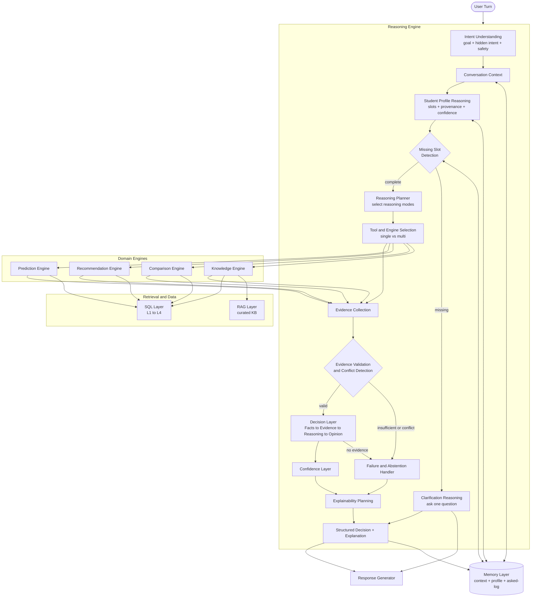

# AI College Counselor — Reasoning Engine Design (05)

**Project:** ChooseYourCollege (CYC)
**Document type:** Component design — the cognitive core that decides *how the AI thinks before it answers*.
**Builds on:** [`01_Knowledge_Audit.md`](./01_Knowledge_Audit.md), [`02_Question_Audit.md`](./02_Question_Audit.md), [`03_AI_System_Architecture.md`](./03_AI_System_Architecture.md), [`04_Recommendation_Engine.md`](./04_Recommendation_Engine.md).
**Scope:** Architecture only — **no code, no prompts, no framework (LangChain/LlamaIndex) implementation.**

> **Relationship to doc 03.** The Reasoning Engine is the **deliberation subsystem** the AI Orchestrator hosts. It formalizes and expands the cognitive responsibilities sketched for the Orchestrator in doc 03 §3, and it consumes the Intent Classifier (doc 03 §4) as its first stage. Division of labor: the **Orchestrator = execution controller** (the runtime loop: dispatch, tool-calling mechanics, timeouts, aggregation); the **Reasoning Engine = the mind** (understand, plan, evaluate, judge, abstain). The domain engines (Prediction, Recommendation, Comparison, Knowledge) are the **hands**.

---

## 1. Purpose of the Reasoning Engine

### 1.1 Why the Recommendation Engine alone is not enough
The Recommendation Engine (doc 04) is a **specialist executor**: given a *well-formed request*, a *complete student profile*, and the intent "recommend colleges," it produces a ranked, explained shortlist. That covers exactly **one** question category (B) out of the ten in doc 02. It cannot, and should not, do the following:

- **Understand what was actually asked.** "Is AI better than CSE?" is a *comparison + trade-off* question, not a recommendation. "Explain counselling and show what I can get" is a *multi-step* question (process + prediction). The Recommendation Engine has no basis to handle either.
- **Decide whether it should even run.** Something must judge that a factual lookup needs SQL, a process question needs RAG, and an eligibility question needs Prediction — *before* any engine is invoked.
- **Gather what's missing.** Recommendation assumes the student profile exists. Someone must detect that "recommend me a college" is missing rank, category, and goal — and ask, once.
- **Reason across engines and turns.** Cross-checking Prediction against allotment data, detecting that two sources conflict, carrying context across a conversation, handling "what if my rank improves" — none of this is a ranking task.
- **Know when to say nothing.** Recommendation always returns a list. A counselor must sometimes answer "that college doesn't exist," "I need your category first," or "I can't compare ROI — we don't have fee data." **Abstention is a decision the Recommendation Engine cannot make.**

In short: the Recommendation Engine answers *"which college?"*. The **Reasoning Engine answers the prior questions** — *what are you really asking, do I have what I need, which capability applies, is my evidence trustworthy, and should I answer at all?*

### 1.2 Why reasoning is a separate architectural component
- **Separation of cognition, execution, and data.** Mixing "how to think" into a ranking engine makes the system brittle and unexplainable. Cognition (planning, strategy, evidence evaluation, abstention) is a distinct concern from execution (engines) and data (SQL/RAG).
- **Universality.** *Every* question category needs reasoning; only some need recommendation. Reasoning is the shared cognitive substrate; engines are invoked situationally.
- **Statefulness is cognitive.** Profile building, "never ask twice," and multi-turn what-if all live at the reasoning level, not inside a stateless engine.
- **Auditability & governance.** Reasoning strategy, the facts→opinion path, and the abstention policy must be inspectable and testable **independently** of any one engine — a hard requirement for an enterprise counseling system that gives consequential advice.

**One-line purpose:** *the Reasoning Engine turns a raw utterance into a grounded, confidence-scored, explainable decision — or a principled refusal — by deciding what to think about, which tools to use, whether the evidence supports a judgment, and how sure it is.*

---

## 2. Responsibilities

Grouped into seven cognitive phases:

| Phase | Responsibilities |
|---|---|
| **Understand** | Understand the explicit **user goal**; infer **hidden intent** (e.g., "which college is good?" hides a personalized eligibility+quality ask); disambiguate; detect out-of-scope/unsafe. |
| **Model the student** | Build and maintain the **student profile**; infer attributes from context; **never ask the same question twice**. |
| **Plan** | **Detect missing information** (slot gaps); choose the **reasoning strategy/mode** (§4); select **tools/engines** and **sequence** them (§6). |
| **Gather** | Drive **evidence collection** through engines/retrieval; request only what the chosen strategy needs. |
| **Evaluate** | **Validate evidence** (provenance, freshness, relevance); **detect conflicts** across sources; assess sufficiency. |
| **Decide** | **Make the decision** (eligibility verdict, ranking, comparison verdict); **generate opinion** *from evidence only*; **quantify uncertainty/confidence**; **know when to abstain**. |
| **Explain & Govern** | Plan the **explanation** (evidence, reasons, trade-offs, gaps, alternatives); enforce **grounding / anti-hallucination**; enforce **privacy/scope guardrails**. |

Every one of these is a first-class, testable responsibility — not an emergent side effect of a prompt.

---

## 3. Reasoning Workflow

The complete pipeline, with the feedback loops that make it a *conversation* rather than a one-shot:

```
USER TURN
   │
   ▼
① INTENT ────────────── classify category + hidden intent + safety flag        (Intent Classifier)
   │
   ▼
② CONVERSATION CONTEXT ─ pull recent turns + prior decisions                    (Memory: short-term)
   │
   ▼
③ STUDENT PROFILE ────── load/merge known slots + provenance + confidence       (Memory: profile)
   │
   ▼
④ MISSING-SLOT DETECTION ─ which required slots for THIS reasoning mode are absent?
   │        │
   │        └─(missing & un-inferable)─► CLARIFICATION reasoning ─► ask ONE targeted question ─► stop turn
   ▼
⑤ REASONING PLANNER ──── choose reasoning mode(s) (§4) + build an execution plan (§6)
   │
   ▼
⑥ TOOL / ENGINE SELECTION ─ SQL? RAG? Prediction? Recommendation? Comparison? single or multi?
   │
   ▼
⑦ EVIDENCE COLLECTION ── execute plan; engines/retrieval return facts + provenance (§7 Facts→Evidence)
   │
   ▼
⑧ EVIDENCE VALIDATION ── check provenance, freshness, relevance, sufficiency; DETECT CONFLICTS
   │        │
   │        └─(insufficient / irreconcilable conflict)─► FAILURE HANDLER ─► abstain / caveat / re-plan (§10)
   ▼
⑨ DECISION MAKING ────── apply rules + reasoning over validated evidence → verdict/ranking/answer (§7)
   │
   ▼
⑩ CONFIDENCE CALCULATION ─ composite confidence from data + inference + outcome certainty (§8)
   │
   ▼
⑪ EXPLANATION PLANNING ─ assemble evidence, reasons, trade-offs, gaps, alternatives (§9)
   │
   ▼
⑫ RESPONSE GENERATION ── hand structured decision + explanation to Response Generator (doc 03 §15)
   │
   ▼
   Memory write-back: updated slots, decisions, what was shown / already asked
```

**Stage explanations:**
1. **Intent** — the reasoning entry point; establishes category, hidden intent, and whether the turn is even in scope.
2. **Conversation context** — recent dialogue so the turn is interpreted in flow, not in isolation.
3. **Student profile** — the accumulated, provenance-tagged model of the student (§5); the reason the AI "remembers."
4. **Missing-slot detection** — compares the *required* slots for the chosen reasoning mode against what's known; the gate that triggers clarification instead of guessing.
5. **Reasoning planner** — selects the reasoning mode(s) and drafts the plan; the cognitive center.
6. **Tool/engine selection** — turns the plan into concrete engine/retrieval calls (§6).
7. **Evidence collection** — runs those calls; returns raw facts with provenance.
8. **Evidence validation** — the trust checkpoint: is the evidence fresh, relevant, sufficient, self-consistent? Conflicts route to failure handling.
9. **Decision making** — deterministic rules + reasoning convert validated evidence into a judgment (§7).
10. **Confidence calculation** — scores how much to trust the decision (§8).
11. **Explanation planning** — structures the justification so explainability is guaranteed, not optional (§9).
12. **Response generation** — deliberation ends; composition begins (handoff to the Response Generator).

**Loops:** stage 4 can loop out to clarification; stage 8 can loop back to re-plan (5) or out to abstention (10). The pipeline is a controlled cycle, not a straight line.

---

## 4. Types of Reasoning (reasoning modes)

The Planner selects one or more modes. Each mode is a **strategy template**: a trigger, the engines it uses, and its output shape.

| Mode | Triggered when… | Engines/retrieval used | Produces |
|---|---|---|---|
| **Eligibility reasoning** | "can I get X?" / feasibility | Prediction (numeric L2) | eligible set + risk tier + admission probability |
| **Recommendation reasoning** | "what should I pick?" | Prediction → Recommendation | ranked, justified shortlist |
| **Comparison reasoning** | "A vs B / which is better?" | SQL facts → Comparison | normalized matrix + grounded verdict |
| **Trade-off reasoning** | competing goods ("better college vs better branch") | Comparison/Recommendation + rules | explicit trade-off with weighted resolution |
| **Constraint reasoning** | hard limits present (budget, location, category, branch) | Rule Engine + SQL | feasible-under-constraints set; flags impossible constraints |
| **Goal-based reasoning** | stated objective (placement/research/proximity) | Recommendation with goal weight profile | goal-aligned ranking/answer |
| **Multi-step reasoning** | compound question needing several capabilities | fan-out across engines, sequenced | merged multi-part answer |
| **Clarification reasoning** | required slot missing & un-inferable | none (asks) | one targeted question; pauses the turn |
| **What-if reasoning** | hypothetical change ("if my rank were 5000") | re-run Prediction/Recommendation on altered profile | counterfactual result vs baseline |
| **Definitional / explanatory** | "what does X mean / how does it work" | RAG (curated KB) | grounded explanation with citations |
| **Abstention reasoning** | evidence insufficient / entity absent / data missing | Failure Handler (§10) | principled refusal + what's needed |

**How each works (brief):**
- **Eligibility** is deterministic and numeric — the gate everything else depends on.
- **Recommendation** layers judgment on eligibility (doc 04).
- **Comparison** fixes facts first, then forms a verdict — opinion strictly after evidence.
- **Trade-off** surfaces the tension explicitly and resolves it against the student's weights, rather than hiding it.
- **Constraint** can conclude "no option satisfies all your hard limits" — a valid, honest outcome.
- **Goal-based** swaps the weight profile so the same machinery serves different students.
- **Multi-step** decomposes a compound turn, runs sub-reasonings, and re-composes — the hallmark of a counselor over a lookup bot.
- **Clarification** is *reasoning about what it doesn't know* — choosing to ask rather than assume.
- **What-if** reuses the pipeline over a hypothetical profile snapshot without mutating the real profile.
- **Abstention** is a terminal reasoning outcome, not an error.

---

## 5. Student Profile Reasoning

The profile is a **living, provenance-aware slot model** maintained across the conversation (persisted in the Memory Layer, doc 03 §14). It is *how the AI accumulates understanding* and the mechanism behind "never ask twice."

### 5.1 Attribute model
Each attribute is a **slot**, not a bare value. A slot carries: `value · source · confidence · timestamp · mutability`.

| Group | Attributes | Typical source |
|---|---|---|
| **Hard identifiers** (gate inputs) | Rank, Cutoff, Community | explicitly stated |
| **Constraints** | District, Budget, Preferred Branch, Hostel Requirement, Language Preference | stated or inferred |
| **Goals & disposition** | Career Goal, Research Interest, Placement Priority, Risk Appetite | stated, inferred, or defaulted |

**Slot source taxonomy** (this is what makes reasoning honest):
- **Stated** — the student said it → high confidence.
- **Inferred** — derived from context (e.g., "I want to do MS abroad" ⇒ Research Interest = high, Placement Priority = lower) → medium confidence, and **flagged as an assumption** in the explanation.
- **Defaulted** — a safe default when nothing is known (e.g., Risk Appetite = balanced) → low confidence, easily overridden.

### 5.2 Update & consistency policy
- **Merge, don't overwrite blindly:** a newer *stated* value supersedes an *inferred*/*defaulted* one.
- **Contradiction handling:** if the student changes a value ("actually, I can relocate"), the profile updates and the Reasoning Engine **invalidates dependent conclusions** (e.g., re-runs a location-constrained recommendation).
- **Inference propagation:** setting one slot may *suggest* others (goal ⇒ weight profile), always as lower-confidence, overridable inferences.

### 5.3 "Never ask the same question twice" mechanism
Before any clarification, the Missing-Slot Detector (stage ④) applies this order:
1. **Check the profile** — is the slot already known (any source)?
2. **Try to infer** — can it be derived from existing slots/context at acceptable confidence?
3. **Check the asked-log** — was this already asked (even if unanswered)? If so, don't re-ask; proceed with best-effort + caveat, or ask differently.
4. **Only then ask** — and **batch** related missing slots into one question to minimize friction.
This log of *asked* and *answered* slots (in Memory) is what guarantees the counselor never loops.

---

## 6. Planning Layer

The Planner converts *(intent + profile + data-need)* into an **execution plan**: which engines and retrieval run, alone or together, and in what order.

### 6.1 Decision process
```
1. Determine reasoning mode(s) from intent (+ hidden intent).           (§4)
2. Look up the mode's canonical engine plan.                            (table below)
3. Check preconditions:
     • required slots present or inferable?   → else CLARIFICATION
     • entities resolve to real colleges/branches? → else FAILURE (not-found)
     • required datasets exist (not FEES/CALENDAR-gapped)? → else ABSTAIN/caveat
4. Decide single vs multi-engine:
     • one capability  → single engine
     • compound intent → FAN-OUT (multi-step), then merge
5. Sequence dependencies:
     • Recommendation depends on Prediction (eligibility first)
     • Comparison depends on SQL facts
     • "both SQL+RAG" for value+meaning questions
6. Emit plan (ordered engine calls + expected evidence contract).
```

### 6.2 Canonical mode → engine plan
| Reasoning mode | SQL | RAG | Prediction | Recommendation | Comparison | Pattern |
|---|:--:|:--:|:--:|:--:|:--:|---|
| Eligibility | ● | | ● | | | single |
| Recommendation | ● | | ● | ● | | sequential (Pred→Rec) |
| Comparison | ● | | | | ● | single (multi-fetch) |
| Trade-off | ● | ○ | | ● | ● | multi |
| Constraint | ● | | ● | ● | | filtered |
| Goal-based | ● | | ● | ● | | weighted |
| Multi-step (e.g., "explain counselling + what I can get") | ● | ● | ● | | | **fan-out + merge** |
| Definitional/FAQ | | ● | | | | single (RAG) |
| What-if | ● | | ● | ● | ○ | re-run on hypothetical |
| Clarification / Abstention | | | | | | none (ask/refuse) |

(● required, ○ situational.)

**Who decides:** step 1–2 are **deterministic policy** (mode→plan mapping, auditable). Steps 3–5 combine deterministic precondition checks with **LLM planning** for novel or compound turns the policy table doesn't cover exactly. This keeps the common path predictable and the long tail flexible.

---

## 7. Decision Layer

How the AI converts information into a **grounded opinion** — the strict pipeline that makes opinions trustworthy:

```
FACTS       raw retrieved values / passages, each with provenance          (SQL rows, RAG passages)
   ▼
EVIDENCE    facts made relevant: normalized, filtered to the question,      (aligned to student + normalized)
            aligned to the student, tagged with vintage & confidence
   ▼
REASONING   rules + trade-off logic + synthesis applied over evidence       (Rule Engine + engines + LLM synthesis)
   ▼
OPINION     a judgment: eligibility verdict / ranking / comparison verdict  (labeled as judgment)
   ▼
EXPLANATION the justification linking the opinion back to its evidence      (evidence graph → narrative)
```

**Definitions & guarantees:**
- **Facts** are never trusted as final answers on their own — they are inputs.
- **Evidence** is facts that survived validation (stage ⑧) and were made comparable/relevant.
- **Reasoning** is where deterministic rules and (bounded) LLM synthesis combine — *this* is where thinking happens.
- **Opinion** is explicitly labeled as judgment and **carries pointers to the evidence nodes that produced it** (an evidence graph).
- **Hard rule — no opinion without evidence:** if the evidence set is empty or insufficient for a claim, the Decision Layer produces **no opinion** and routes to abstention (§10). The LLM may never manufacture a verdict the evidence graph doesn't support.

This is the same discipline as doc 04 (compute the judgment; verbalize it) elevated to *all* reasoning, not just recommendation.

---

## 8. Confidence Layer

Confidence is **multi-dimensional** and composed, then propagated to the answer and to the abstention decision.

| Dimension | Question it scores | Signals |
|---|---|---|
| **Data completeness** | did we have the inputs? | share of required factors/slots with real (non-imputed) values |
| **Freshness** | how current is the data? | vintage vs recency policy (penalizes `YEAR@L1`, thin NIRF history) |
| **Evidence agreement** | do sources concur? | cross-source consistency (Prediction vs allotment vs L1 outcomes) |
| **Missing values** | what did we have to impute? | count/weight of neutral-imputed inputs |
| **Prediction certainty** | how sure is eligibility? | rank distance inside the closing band; demand stability |
| **Recommendation certainty** | how clear is the ranking? | score separation between neighbors (doc 04 §6) |
| **Reasoning certainty** | how many inferential leaps? | number/confidence of inferred slots & assumptions used |

**Composition & use:**
- Sub-scores combine into an overall confidence **with the weakest dimensions surfaced** (a chain is as strong as its weakest link — one heavily-imputed dimension caps the whole).
- **Thresholds drive behavior:** high → assertive answer; medium → answer with explicit caveats; low → hedge heavily or **abstain** (§10).
- Confidence is **reported**, never hidden, and **calibrated to tone** in the response ("strong match" vs "worth a look, but limited data").

Confidence here is broader than doc 04's recommendation-confidence: it also scores the *reasoning process itself* (agreement, inference depth), not only the recommendation inputs.

---

## 9. Explainability Layer

Explainability is a **byproduct of structured reasoning**, not a post-hoc rationalization: the reasoning trace *is* the explanation source. Every answer carries six mandatory elements:

| Element | Sourced from | Purpose |
|---|---|---|
| **Evidence** | Facts→Evidence nodes (§7) + provenance | show what the answer stands on |
| **Reason** | Reasoning node (rules + synthesis) | why the evidence leads to this conclusion |
| **Trade-offs** | Trade-off/Comparison reasoning | what was weighed and given up |
| **Confidence** | Confidence Layer (§8) | how much to trust it |
| **Missing information** | Failure/gap detection (§10) + gap register | what could not be considered (`FEES`, distance, etc.) |
| **Alternative options** | ranked runners-up / other-tier picks | what else to consider and why it ranked lower |

**Two-layer model (consistent with doc 04):** a **deterministic explanation object** (the evidence graph + contributions + gaps) is computed first; the LLM then **narrates** it faithfully, adding no reason absent from the object. This is what makes justifications defensible in an enterprise setting.

---

## 10. Failure Handling

**Abstention and honesty are first-class outcomes.** The Reasoning Engine must be able to end a turn without an answer. The anti-hallucination guarantee is enforced here.

| Failure condition | Detection | Behavior (never hallucinate) |
|---|---|---|
| **Data missing** (`FEES`, `CALENDAR`, `SEAT-MATRIX`, `GEO`…) | precondition check (stage ⑥) against gap register | state plainly "I don't have that data yet"; answer the parts that *are* supported |
| **Information conflicts** (sources disagree) | evidence validation (stage ⑧) cross-check | prefer the higher-provenance/fresher source; if irreconcilable, **disclose the conflict** and lower confidence, or abstain |
| **Ambiguous question** | low intent confidence / multiple valid readings | **clarification reasoning** — ask one disambiguating question, don't guess |
| **College doesn't exist** | entity resolution fails against `colleges`/`Cutoff` | say it wasn't found; suggest close matches; **never invent** a college |
| **Branch doesn't exist** (at that college) | branch resolution fails | say the branch isn't offered there; list available branches |
| **No recommendation possible** (constraints unsatisfiable / no eligible seat) | empty feasible set after gates/constraints | say so honestly; offer to relax a constraint (what-if) rather than fabricate a fit |
| **Insufficient evidence for an opinion** | Decision Layer finds empty evidence graph | produce **no opinion**; explain what's needed |
| **Out-of-scope / unsafe** (Category J) | safety flag at intent | bounded refusal / redirect (doc 02 §11) |

**Governing rule:** when in doubt, the Reasoning Engine **degrades to a smaller, fully-grounded answer or a principled refusal** — it never closes the gap with invention. Every failure path yields an *actionable* next step (what to provide, what to relax, what to try).

---

## 11. Architecture Diagram



---

## 12. Integration Summary

The Reasoning Engine is the **conductor**; every other component is an instrument it directs or a store it reads. It never holds facts or runs SQL itself — it decides, delegates, evaluates, and judges.

| Component | Reasoning Engine sends → | ← receives | Nature of relationship |
|---|---|---|---|
| **Knowledge Engine** | a fact or concept need (tagged SQL / RAG / both) | grounded facts and/or cited explanations | delegates *information* lookup (Categories D/F/G/H) |
| **Prediction Engine** | student rank/cutoff + category (+ filters) | eligible set, risk tiers, admission probability | delegates the deterministic *eligibility gate* — the dependency most other modes rest on |
| **Recommendation Engine** | eligible set + profile + goal weights | ranked, explained shortlist + confidences | delegates *judgment/ranking*; consumes its explanation for the final answer |
| **Comparison Engine** | 2+ resolved entities + dimensions | normalized matrix + grounded verdict | delegates *side-by-side judgment* |
| **SQL Layer** | *(via engines/Knowledge)* constrained query intents | typed rows + provenance | never called directly — always through an engine, preserving the layering |
| **RAG Layer** | *(via Knowledge Engine)* topic/question | cited passages | supplies *process/policy/definition* knowledge only |
| **Memory Layer** | updated slots, decisions, asked/answered log | conversation context + student profile | the Reasoning Engine's read/write **state store**; source of "never ask twice" |
| **Response Generator** | the structured decision + explanation object (or refusal + next step) | — | hands off when deliberation ends; composition is the Response Generator's job (doc 03 §15) |

**End-to-end in one sentence:** the Reasoning Engine receives an utterance, understands it against the student profile in Memory, plans which engines and retrieval to use, collects and *validates* evidence through them, converts that evidence into a confidence-scored, explainable decision **or a principled abstention**, and hands a structured result to the Response Generator — so that the counselor's every answer is understood, grounded, justified, sure-of-itself only when it should be, and honest when it isn't.

---

*Architecture only — no code, prompts, or framework implementation. This document defines the cognitive contract for the AI College Counselor and completes the reasoning design begun in docs 03–04.*
