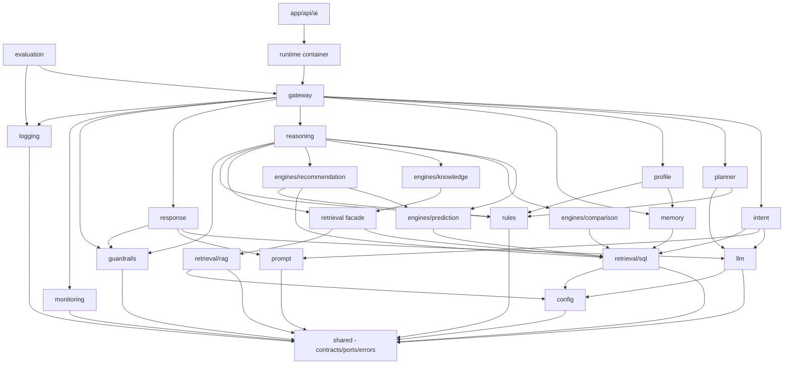

# AI College Counselor — Project Structure & Repository Design (07)

**Project:** ChooseYourCollege (CYC) — existing production Next.js 14 (App Router, standalone, Supabase, Azure Container Apps).
**Document type:** Repository/engineering structure — turns the modules of [`06_Implementation_Modules.md`](./06_Implementation_Modules.md) into a concrete project skeleton inside the existing app.
**Scope:** Structure, contracts, wiring, and cross-cutting strategies. **No implementation/feature code.** File names and interface contracts are declared; bodies are not.

> This document does not add or change architecture (docs 03–05) or modules (doc 06). It is the *engineering layout* those modules are built into.

---

## 0. Placement within the existing repository

Three integration surfaces, mirroring the existing repo's conventions (`lib/` for logic, `app/api/` for routes, `components/` for UI, `@/*` path alias):

- **`lib/ai/`** — the entire AI core, framework-agnostic TypeScript, no Next coupling → independently testable and portable.
- **`app/api/ai/`** — thin route handlers (auth + stream + delegate only).
- **`components/counselor/`** — the chat UI.
- **`supabase/ai/`** — migrations + RLS policies for new AI tables.
- **`tests/ai/`** — fixtures, port fakes, and the golden eval set.

The existing `lib/parameters.ts`, `lib/college-service.ts`, `lib/college-data.ts`, `lib/supabase.ts` are **wrapped, not modified**.

---

## 1. Complete folder structure

```
cyc_originals/
├── app/
│   └── api/ai/
│       ├── chat/route.ts                 # streaming entry → Gateway
│       ├── feedback/route.ts             # thumbs / corrections → Logger
│       └── health/route.ts               # counselor readiness
│
├── components/counselor/
│   ├── chat-panel.tsx
│   ├── message-list.tsx
│   ├── message-input.tsx
│   ├── blocks/                           # structured render blocks
│   │   ├── eligibility-list.tsx
│   │   ├── comparison-table.tsx
│   │   ├── recommendation-cards.tsx
│   │   └── citations.tsx
│   └── hooks/use-counselor-stream.ts
│
├── lib/ai/
│   ├── shared/                           # ← the dependency root (contracts only)
│   │   ├── contracts/                    # cross-module DTOs (types only)
│   │   │   ├── request-context.ts
│   │   │   ├── intent.ts
│   │   │   ├── profile.ts
│   │   │   ├── plan.ts
│   │   │   ├── evidence.ts
│   │   │   ├── decision.ts
│   │   │   ├── eligibility.ts
│   │   │   ├── comparison.ts
│   │   │   ├── knowledge.ts
│   │   │   ├── recommendation.ts
│   │   │   └── response.ts
│   │   ├── ports/                        # hexagonal interfaces (adapters implement)
│   │   │   ├── llm.port.ts
│   │   │   ├── sql.port.ts
│   │   │   ├── vector-index.port.ts
│   │   │   ├── logger.port.ts
│   │   │   ├── telemetry.port.ts
│   │   │   ├── clock.port.ts
│   │   │   └── config.port.ts
│   │   ├── errors/{ai-error.ts, error-codes.ts, index.ts}
│   │   ├── result.ts                     # Result<T> envelope
│   │   ├── ids.ts                        # branded id types
│   │   └── index.ts                      # public barrel
│   │
│   ├── config/{schema.ts, load.ts, flags.ts, index.ts}
│   ├── runtime/{container.ts, request-context.ts, index.ts}   # composition root
│   │
│   ├── llm/{client.ts, tiers.ts, create-llm.ts, types.ts, adapters/anthropic.adapter.ts, __tests__/, index.ts}
│   ├── rules/{weight-profiles.ts, risk-tiers.ts, mode-engine-map.ts, gap-register.ts, entitlements.ts, index.ts}
│   ├── prompt/{persona.ts, contracts.ts, registry.ts, versions.ts, templates/, index.ts}
│   ├── guardrails/{inbound.ts, outbound.ts, scope.ts, create-guardrails.ts, index.ts}
│   │
│   ├── retrieval/
│   │   ├── sql/
│   │   │   ├── catalog/{prediction.queries.ts, comparison.queries.ts, knowledge.queries.ts, exploration.queries.ts, user.queries.ts}
│   │   │   ├── bridge.ts                 # counselling_code ↔ nirf_id ↔ College Code joins
│   │   │   ├── supabase.adapter.ts       # implements sql.port
│   │   │   ├── governance.ts             # RLS/auth-scoping enforcement
│   │   │   ├── create-sql.ts
│   │   │   ├── types.ts
│   │   │   ├── __tests__/
│   │   │   └── index.ts
│   │   ├── rag/
│   │   │   ├── corpus/                    # authored KB content (Markdown, not code)
│   │   │   ├── indexer.ts
│   │   │   ├── retriever.ts
│   │   │   ├── reranker.ts
│   │   │   ├── vector.adapter.ts          # implements vector-index.port
│   │   │   ├── create-rag.ts
│   │   │   └── index.ts
│   │   ├── router.ts
│   │   ├── merge.ts
│   │   ├── provenance.ts
│   │   ├── cache.ts
│   │   ├── create-retrieval.ts
│   │   └── index.ts
│   │
│   ├── engines/
│   │   ├── prediction/{numeric-matcher.ts, category-logic.ts, risk-tiering.ts, create-prediction.ts, types.ts, __tests__/, index.ts}
│   │   ├── comparison/{fetch.ts, normalize.ts, scorer.ts, create-comparison.ts, __tests__/, index.ts}
│   │   ├── knowledge/{fact-path.ts, concept-path.ts, benchmark.ts, create-knowledge.ts, index.ts}
│   │   └── recommendation/
│   │       ├── eligibility-adapter.ts
│   │       ├── constraint-filter.ts
│   │       ├── evidence-collector.ts
│   │       ├── scorer.ts
│   │       ├── portfolio.ts
│   │       ├── explain.ts
│   │       ├── create-recommendation.ts
│   │       ├── __tests__/
│   │       └── index.ts
│   │
│   ├── intent/{classifier.ts, entity-resolver.ts, taxonomy.ts, create-intent.ts, __tests__/, index.ts}
│   ├── memory/{store.ts, context-assembler.ts, summarizer.ts, asked-log.ts, create-memory.ts, index.ts}
│   ├── profile/{slot-model.ts, merge-policy.ts, inference.ts, completeness.ts, create-profile.ts, __tests__/, index.ts}
│   ├── planner/{mode-selector.ts, plan-builder.ts, precondition-checks.ts, create-planner.ts, __tests__/, index.ts}
│   ├── reasoning/{evidence-validator.ts, conflict-detector.ts, decision-layer.ts, confidence.ts, explanation-planner.ts, failure-handler.ts, create-reasoning.ts, __tests__/, index.ts}
│   ├── response/{composer.ts, structured-blocks.ts, citations.ts, followups.ts, create-response.ts, index.ts}
│   ├── gateway/{turn-orchestrator.ts, stream.ts, guards.ts, create-gateway.ts, index.ts}
│   │
│   ├── evaluation/{golden-sets/, scorers.ts, runner.ts, reports.ts, index.ts}
│   ├── monitoring/{tracing.ts, metrics.ts, alerts.ts, create-monitoring.ts, index.ts}
│   └── logging/{writer.ts, schema.ts, feedback.ts, retention.ts, create-logging.ts, index.ts}
│
├── supabase/ai/
│   ├── migrations/            # ai_conversations, ai_messages, ai_student_profiles, ai_feedback, ai_kb_documents, ai_eval_*
│   └── policies/              # RLS policies (governance gate, doc 01 §4)
│
└── tests/ai/
    ├── fixtures/              # data fixtures (cutoffs, params, colleges)
    ├── fakes/                 # in-memory port implementations
    ├── golden/               # doc 02 question suite + expected behaviors
    └── integration/
```

**Standard file-set per module** (every `lib/ai/<module>/` follows this skeleton):
- `index.ts` — the **only** public surface (barrel); exports the module's contract + `create<Module>()` factory.
- `create-<module>.ts` — the DI factory (takes ports/deps, returns the public interface).
- `types.ts` — module-local types (cross-module types live in `shared/contracts`).
- internal component files — the sub-components from doc 06 (e.g., `scorer.ts`).
- `__tests__/` — unit tests colocated per module.

---

## 2. Folder responsibilities

| Folder | Responsibility |
|---|---|
| `lib/ai/shared/` | The dependency root: contracts, ports, errors, ids. **Depends on nothing.** |
| `lib/ai/config/` | Typed, validated, fail-fast configuration + feature flags. |
| `lib/ai/runtime/` | Composition root — wires all factories; builds per-turn `RequestContext`. |
| `lib/ai/llm/` | Provider-agnostic model access + tiering (LLM Client). |
| `lib/ai/rules/` | Deterministic business rules/config (weights, tiers, mode map, gap register, entitlements). |
| `lib/ai/prompt/` | Persona, templates, output contracts, versioning. |
| `lib/ai/guardrails/` | Inbound/outbound safety, scope-bounding, PII/auth scoping. |
| `lib/ai/retrieval/` | Grounding facade (`router/merge/provenance/cache`) over `sql/` + `rag/`. |
| `lib/ai/retrieval/sql/` | Semantic query catalog + Supabase adapter + identifier bridge + governance. |
| `lib/ai/retrieval/rag/` | Curated KB corpus + indexer/retriever/reranker + vector adapter. |
| `lib/ai/engines/*` | Domain engines: prediction, comparison, knowledge, recommendation. |
| `lib/ai/intent/` | Utterance → routing decision + entities. |
| `lib/ai/memory/` | Conversation state, working slots, asked-log. |
| `lib/ai/profile/` | Provenance-aware student slot model. |
| `lib/ai/planner/` | Reasoning-mode selection + execution plan. |
| `lib/ai/reasoning/` | Deliberation core (validation, decision, confidence, explanation, abstention). |
| `lib/ai/response/` | Grounded NL + structured payload composition. |
| `lib/ai/gateway/` | Turn entry + orchestration loop + streaming. |
| `lib/ai/evaluation/` | Golden-set scoring + regression gate. |
| `lib/ai/monitoring/` | Tracing/metrics/alerts. |
| `lib/ai/logging/` | Durable, governed conversation log + feedback. |
| `app/api/ai/` | Thin HTTP handlers → Gateway. |
| `components/counselor/` | Chat UI + structured blocks. |
| `supabase/ai/` | AI schema + RLS. |
| `tests/ai/` | Fixtures, fakes, golden suite, integration. |

---

## 3. Interfaces between modules (contracts, not code)

### 3.1 Shared DTO contracts (`shared/contracts/`) — the seam between modules
| Contract | Produced by | Consumed by |
|---|---|---|
| `RequestContext {userId, sessionId, turnId, traceId, auth}` | runtime | all |
| `IntentResult {category, subIntent, engines, dataNeed, slots, safetyFlag, confidence}` | intent | planner, reasoning |
| `StudentProfile {slots: Record<slot, {value, source, confidence, ts, mutable}>}` | profile | planner, recommendation, reasoning |
| `ExecutionPlan {steps[], modes[], evidenceContract}` \| `Directive(clarify\|abstain)` | planner | reasoning |
| `EvidenceBundle {rows[], passages[], provenance[]}` | retrieval | engines, reasoning |
| `EligibilityResult {options[], tiers, probabilityBands, limits}` | prediction | recommendation, reasoning |
| `ComparisonMatrix {dimensions[], values, winners, deltas, gaps}` | comparison | reasoning |
| `KnowledgeResult {facts[], passages[], provenance[]}` | knowledge | reasoning |
| `Recommendations {ranked[], perItem{score, contributions, tier, confidence, citations, caveats}}` | recommendation | reasoning |
| `Decision {answer, evidenceGraph, confidence, explanation, gaps}` \| `Abstention` | reasoning | response |
| `ResponsePayload {narrative, blocks[], citations[], followups[], confidence}` | response | gateway → UI |

### 3.2 Ports (`shared/ports/`) — external boundaries (adapters implement)
| Port | Operations (named, not code) | Adapter |
|---|---|---|
| `LlmPort` | `complete(spec, tier)`, `stream(spec, tier)` | `llm/adapters/anthropic.adapter` |
| `SqlPort` | `run(queryIntent) → ResultSet` | `retrieval/sql/supabase.adapter` |
| `VectorIndexPort` | `search(query, k)`, `upsert(docs)` | `retrieval/rag/vector.adapter` |
| `LoggerPort` | `debug/info/warn/error(event)` | `monitoring`/`logging` |
| `TelemetryPort` | `span(name, attrs)`, `metric(name, value)` | `monitoring` |
| `ClockPort` | `now()` | runtime (real) / fake (tests) |
| `ConfigPort` | typed config accessors | `config` |

**Rule:** modules depend on **ports and contracts**, never on concrete adapters — the basis of testability and provider-swap.

---

## 4. Dependency graph



**Layered read (build-safe, acyclic):**
`shared` → foundations (`config, llm, prompt, rules, guardrails, monitoring, logging, sql, rag`) → `retrieval` → deterministic engines (`prediction, comparison, knowledge`) → `recommendation` → cognition (`intent, memory, profile, planner`) → `reasoning` → `response` → `gateway` → `runtime` → `api`.

---

## 5. Independent vs dependent modules

### 5.1 Completely independent (only `shared`/`config` + externals → buildable in parallel first)
`shared`, `config`, `prompt`, `rules`, `monitoring`, `guardrails`, `llm` (→config), `retrieval/sql` (→externals: Supabase, `lib/parameters`), `retrieval/rag` (→external index), `logging`.
These have **no AI-internal module dependencies** and can be developed and tested simultaneously.

### 5.2 Dependent (composed from others)
| Module | Depends on |
|---|---|
| `retrieval` (facade) | sql, rag |
| `engines/prediction` | sql, rules |
| `engines/comparison` | sql, rules |
| `engines/knowledge` | retrieval (sql+rag) |
| `engines/recommendation` | prediction, sql, rules |
| `intent` | llm, prompt, sql |
| `memory` | sql |
| `profile` | memory, sql, rules |
| `planner` | rules, llm |
| `reasoning` | all engines, retrieval, rules, guardrails |
| `response` | llm, prompt, guardrails |
| `gateway` | intent, planner, profile, memory, reasoning, response, guardrails, monitoring, logging |
| `evaluation` | gateway, logging |
| `runtime` | everything (composition root) |

---

## 6. Shared contracts module (`shared/`) — detail

- **Only types & pure helpers, zero runtime dependencies** — so it can be imported by every module without cycles.
- **`contracts/`** — the DTOs above; the *lingua franca* between modules. Changing a contract is a deliberate, reviewed cross-module event.
- **`ports/`** — external-boundary interfaces (hexagonal). Adapters live in their owning modules; ports live here so any module can depend on the interface without depending on the implementation.
- **`errors/`** — the typed error hierarchy (§12).
- **`result.ts`** — a `Result<T>` success/failure envelope for flows that prefer values over exceptions (used internally by engines; the Gateway is the throw/catch boundary).
- **`ids.ts`** — branded id types (`UserId`, `SessionId`, `TurnId`, `NirfId`, `CounsellingCode`) to prevent mixing the two identifier systems (a real doc 01 hazard).

---

## 7. Naming conventions

| Artifact | Convention | Example |
|---|---|---|
| Folders & files | `kebab-case` | `risk-tiering.ts` |
| Port files | `*.port.ts` | `llm.port.ts` |
| Adapter files | `*.adapter.ts` | `supabase.adapter.ts` |
| Factory files | `create-<module>.ts` | `create-prediction.ts` |
| Query-catalog files | `<domain>.queries.ts` | `prediction.queries.ts` |
| Test files | `*.test.ts` in `__tests__/` | `scorer.test.ts` |
| Types/interfaces | `PascalCase`, **no `I` prefix** | `EvidenceBundle` |
| Functions/vars | `camelCase` | `resolveProfile` |
| Constants | `SCREAMING_SNAKE_CASE` | `DEFAULT_WEIGHT_PROFILE` |
| Barrels | `index.ts` per module (public API only) | — |

Consistent with the existing repo's kebab-case files and PascalCase types.

---

## 8. Import conventions

- **Barrel-only cross-module imports:** a module may import another **only through its `index.ts`** via the `@/lib/ai/<module>` alias — never deep-import internals (`@/lib/ai/reasoning/decision-layer` is forbidden).
- **Contracts/ports from `@/lib/ai/shared`** only.
- **Relative imports inside a module** (`./scorer`), alias imports across modules.
- **Enforcement:** an ESLint `no-restricted-imports` rule (+ optionally `dependency-cruiser`) bans deep imports and enforces the acyclic layer order in §4. This makes the boundaries *mechanical*, not merely documented.
- Reuse of existing app code goes through its own path (`@/lib/parameters`), wrapped inside the SQL/Prediction modules — no other module imports `lib/parameters` directly.

---

## 9. Dependency Injection strategy

**Lightweight, explicit, framework-free.**
- **Factory functions:** each module exposes `create<Module>(deps)` returning its public interface. Dependencies are passed in (ports + other modules' interfaces) — no singletons, no global state, no service-locator.
- **Composition root:** `runtime/container.ts` is the *single* place that instantiates adapters (real LLM, Supabase, vector index, clock, logger) and wires every `create<Module>()` in layer order. Nothing else news-up an adapter.
- **Ports & adapters (hexagonal):** modules depend on `shared/ports` interfaces; the container injects real adapters in production and **fakes in tests** — the core never knows which.
- **Request scope:** per-turn state (`RequestContext`: auth, ids, traceId) is **passed as an argument**, never stored on a module. Modules are stateless singletons; the turn carries its own context. This keeps concurrent turns isolated (important on the shared Container App instance).
- **Why not a DI framework:** the graph is static and small; explicit factories keep it inspectable and tree-shakeable, and avoid runtime reflection in the Next standalone bundle.

---

## 10. Error handling strategy

- **Typed hierarchy** in `shared/errors`: base `AiError {code, safeMessage, detail, cause}` → `ValidationError`, `NotFoundError` (college/branch), `AbstentionError`, `RetrievalError`, `SqlError`, `LlmError`, `GuardrailError`, `ConflictError`, `ConfigError`.
- **Domain outcomes ≠ exceptions:** *expected* results — abstention, "no eligible seats," "data not available" — are **returned values** (`Decision`/`Abstention`/`Result<T>`), not thrown. Exceptions are for *unexpected* failures.
- **Single throw/catch boundary:** the **Gateway** catches everything, maps to a safe streamed response, and attaches a trace id. **No stack traces or secrets ever reach the client** (directly addressing the QA finding on leaked errors).
- **Fail-fast at boot:** config/adapter wiring errors abort startup (composition root), not mid-turn.
- **Graceful degradation:** retrieval/LLM failures degrade to a smaller grounded answer or an honest abstention — never a fabricated one (doc 05 §10).

---

## 11. Logging strategy

- **Two distinct streams:**
  1. **Operational logging** (ephemeral, observability) via `LoggerPort` → structured JSON, correlated by `traceId`, leveled (debug/info/warn/error). Handled by `monitoring/`.
  2. **Conversation logging** (durable, governed, auditable) via `logging/` → Supabase (`ai_messages`, decisions, provenance, confidence, feedback).
- **Correlation:** every log line and span carries `turnId`/`traceId` from `RequestContext`.
- **PII redaction** is centralized in the logger (no raw emails/phones in operational logs — the doc 01 governance concern applies to logs too).
- **No `console.log`:** replaces the ad-hoc `console.log` pattern in the existing `lib/supabase.ts`; lint-banned in `lib/ai/`.
- **Levels by environment** from `config`; verbose tracing off in production by default.

---

## 12. Configuration strategy

- **Single typed config module (`config/`)** loads and **schema-validates all env at boot** (fail-fast) — no scattered `process.env` reads (contrast the existing code, which reads `process.env` in ~15 places).
- **Typed accessors via `ConfigPort`**; modules receive config through DI, never read env directly.
- **Secrets from the environment** (Azure Container App secrets, per the deployment docs) — never in the repo; the config layer only *reads* them.
- **Feature flags (`flags.ts`)** gate the wave rollout — e.g., `rag.enabled=false` until Wave 4, `personalization.enabled=false` until the RLS governance gate is closed. This lets the counselor ship incrementally without branching.
- **Model tiers, weights, thresholds** live in `rules/`/`config`, tunable without code changes.

---

## 13. Testing strategy

| Level | Target | Location | Notes |
|---|---|---|---|
| **Unit** | pure logic, engines, scorers | `lib/ai/<module>/__tests__/` | ports replaced by `tests/ai/fakes/`; **no LLM/DB** |
| **Numeric-correctness** | prediction comparisons | prediction `__tests__` | **regression-guards the doc 01 numeric-as-text bug** |
| **Contract** | each adapter satisfies its port | per adapter | run real + fake against the same port spec |
| **Integration** | engine + real SQL vs fixtures | `tests/ai/integration/` | seeded test data; verifies the identifier bridge |
| **Golden / eval** | doc 02 question suite | `tests/ai/golden/` + `evaluation/` | scores groundedness, prediction accuracy, **refusal correctness**, citation coverage |
| **E2E** | Gateway stream | `tests/ai/integration/` | full turn with fakes for LLM |

- **Determinism first:** engines/rules are pure and fully testable without the LLM → fast, reliable CI.
- **LLM behind one seam** (`LlmPort`) → mock everywhere; golden-set evals gate prompt/rule changes before merge.
- **Fixtures/fakes** are shared in `tests/ai/` so modules test against consistent data.

---

## 14. Future extensibility

Every likely change has a **defined extension point** — no core rewrite:

| Future need | Extension point | Change is… |
|---|---|---|
| **New dataset (`FEES`, `SEAT-MATRIX`, `GEO`)** | add SQL adapter/queries + `rules` factor/weight config + gap-register update | additive |
| **New engine** (e.g., Scholarship engine) | new `engines/<x>/` + register in `reasoning` mode→engine map | additive |
| **New reasoning mode** | add to `rules/mode-engine-map` + planner policy | config + planner |
| **New query** | add to the SQL `catalog/` registry | additive |
| **New LLM provider** | new `llm/adapters/<provider>.adapter` implementing `LlmPort` | swap in container |
| **New KB content** | add to `retrieval/rag/corpus/` + reindex | content-only |
| **New weight profile / threshold** | `rules/` config | config-only |
| **New UI block** | `components/counselor/blocks/` + `response/structured-blocks` | additive |
| **Swap vector store / DB** | new adapter implementing the port | swap in container |

The **registry pattern** (query catalog, engine registry, mode→engine map, prompt/version registry) and **ports/adapters** are what make these additive: new capability = new file + one registration, wired in the composition root.

---

## 15. Summary

The AI College Counselor lands in the existing app as a **self-contained `lib/ai/` package of ~22 modules**, each following the same skeleton (`index` barrel + `create-*` factory + internals + tests), coupled **only through `shared/` contracts and ports**, and wired in one acyclic **composition root** (`runtime/container.ts`). Thin `app/api/ai/*` routes and a `components/counselor/` UI are the only Next-coupled surfaces; the existing `lib/parameters`/`college-service`/`supabase` assets are wrapped, not touched.

The cross-cutting strategies make the repo enterprise-grade and safe to grow: explicit DI with hexagonal ports (swap adapters, fake in tests), a typed error hierarchy with a single client-facing boundary (**no leaked stack traces**), dual logging (observable + governed) with PII redaction, fail-fast validated config with wave feature-flags, a determinism-first test pyramid that **regression-guards the doc 01 numeric bug** and gates changes on the doc 02 golden set, and registry-based extension points so new datasets, engines, modes, and providers are *additive*.

Enforced by barrel-only imports and an acyclic dependency graph, this structure is buildable in parallel where modules are independent (§5.1) and in strict layer order where they compose (§4) — a repository ready for implementation to begin, **without writing any feature code yet**.

*Structure and contracts only — no implementation. This is the repository blueprint for the AI College Counselor build.*
